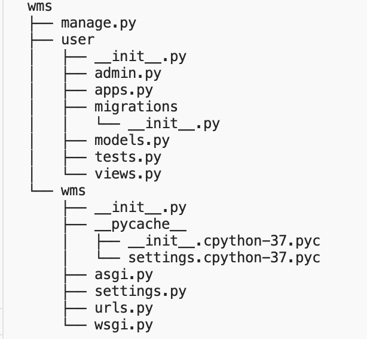

## django中创建从零开始创建项目与应用
1.在合适位置新建一个目录
2.打开命令终端并进入到该目录下
3.在终端执行命令

```python
    django-admin.py startproject wms
```
4.进入上步创建的项目wms,执行下面命令创建一个app:
```python
    python manage.py start app user
```
5. 创建完后，回到项目根目录，可发现项目整体目录如下：


**目录层级说明：**
- manage.py: 它是一个命令行工具，可以用多种方式对django项目进行交互。
- wms(项目目录)：
  
  - \_\_int\_\_.py： 一个空文件，说明该目录被看成一个python包
  - settings.py： 项目的配置文件
  - urls.py：项目的URL声明;
  - wsgi.py: 项目与WSGI兼容的web服务器入口;
